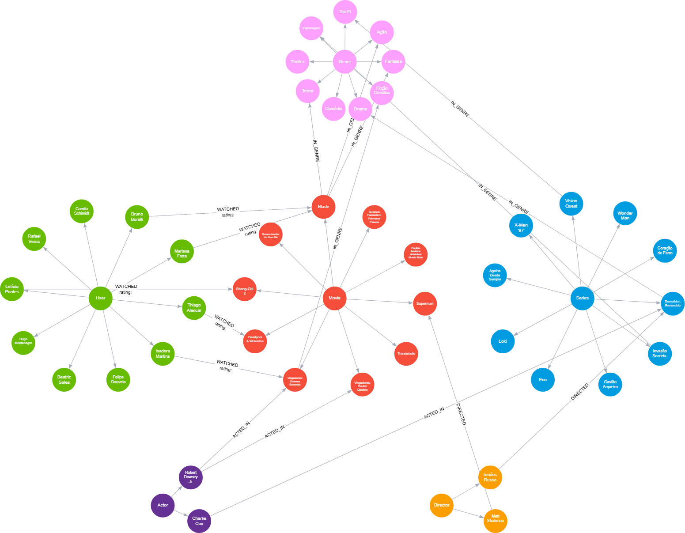

# 📊 Desafio: Modelagem de Dados em Grafos de um Serviço de Streaming

O desafio consiste em desenvolver um novo serviço de streaming de filmes e séries. A primeira tarefa é projetar o banco de dados, focando em relacionamentos para criar um sistema de recomendação poderoso, diferenciando-se dos sistemas tradicionais.

## 🎯 Objetivos

Modelar e criar um grafo de conhecimento para o serviço de streaming com os seguintes componentes:

- **Entidades (nós)**: User, Movie, Series, Genre, Actor, Director
- **Conexões (relacionamentos)**: WATCHED (com propriedade rating), ACTED_IN, DIRECTED, IN_GENRE

## 💡 Solução

### 📈 Diagrama do Modelo de Grafo



### 🔧 Scripts Cypher

#### ➕ CREATE

```cypher
CREATE ()<-[:_RELATED]-(User)-[:_RELATED]->(),
(Blade)<-[:WATCHED {rating: ""}]-()<-[:_RELATED]-(User)-[:_RELATED]->()-[:WATCHED {rating: ""}]->(`Deadpool & Wolverine`)
```

#### 🔍 MATCH

```cypher
MATCH path0 = ()<--(User)-->(),
path1 = (Blade)<-[:WATCHED {rating: ""}]-()<--(User)-->()-[:WATCHED {rating: ""}]->(`Deadpool & Wolverine`)
RETURN path0, path1
```

#### 🔀 MERGE

```cypher
MERGE ()<-[:_RELATED]-(User)-[:_RELATED]->()
MERGE (Blade)<-[:WATCHED {rating: ""}]-()<-[:_RELATED]-(User)-[:_RELATED]->()-[:WATCHED {rating: ""}]->(`Deadpool & Wolverine`)
```

## ✅ Conclusão

O desenvolvimento do modelo evidenciou a importância de estruturar claramente os relacionamentos e direcionamentos entre entidades em um banco de grafos. O uso do diagrama visual facilitou a compreensão e a implementação da solução.

Inicialmente foi difícil construir como seriam as relações de cada grupo no banco de grafos, e definir o direcionamento das setas. Depois adotei o método apresentado pelo diagrama geral e ficou claro como apresentar a solução do desafio.

### ➕ Comandos Cypher - CREATE

```cypher
CREATE ()<-[:_RELATED]-(User)-[:_RELATED]->(),
(Blade)<-[:WATCHED {rating: ""}]-()<-[:_RELATED]-(User)-[:_RELATED]->()-[:WATCHED {rating: ""}]->(`Deadpool & Wolverine`),
()<-[:_RELATED]-(User)-[:_RELATED]->()-[:WATCHED {rating: ""}]->(Blade)-[:IN_GENRE]->(`Ação`),
(`Shang-Chi 2`)<-[:WATCHED {rating: ""}]-()<-[:_RELATED]-(User)-[:_RELATED]->(),
(`Vingadores: Guerras Secretas`)<-[:WATCHED {rating: ""}]-()<-[:_RELATED]-(User)-[:_RELATED]->(),
()<-[:_RELATED]-(Movie)-[:_RELATED]->(),
()<-[:_RELATED]-(Movie)-[:_RELATED]->()<-[:DIRECTED]-(`Matt Shakman`),
(`Ficção Científica`)<-[:IN_GENRE]-(`Vingadores: Guerras Secretas`)<-[:_RELATED]-(Movie)-[:_RELATED]->()<-[:ACTED_IN]-(`Robert Downey Jr.`)-[:ACTED_IN]->(`Vingadores: Guerras Secretas`),
()<-[:_RELATED]-(Movie)-[:_RELATED]->(`Shang-Chi 2`),
(`Deadpool & Wolverine`)<-[:_RELATED]-(Movie)-[:_RELATED]->(Blade)-[:IN_GENRE]->(Terror),
()<-[:_RELATED]-(Series)-[:_RELATED]->(),
(Espionagem)<-[:IN_GENRE]-()<-[:_RELATED]-(Series)-[:_RELATED]->(`Demolidor: Renascido`)-[:IN_GENRE]->(Drama),
()<-[:_RELATED]-(Series)-[:_RELATED]->(),
()<-[:_RELATED]-(Series)-[:_RELATED]->(),
()<-[:_RELATED]-(Series)-[:_RELATED]->()-[:IN_GENRE]->(`Sci-Fi`),
(`Demolidor: Renascido`)<-[:DIRECTED]-()<-[:_RELATED]-()-[:_RELATED]->(`Matt Shakman`),
(`Demolidor: Renascido`)<-[:ACTED_IN]-()<-[:_RELATED]-()-[:_RELATED]->(`Robert Downey Jr.`),
(`Ficção Científica`)<-[:_RELATED]-(Genre)-[:_RELATED]->(`Ação`),
(Terror)<-[:_RELATED]-(Genre)-[:_RELATED]->(`Sci-Fi`),
(Drama)<-[:_RELATED]-(Genre)-[:_RELATED]->(),
()<-[:_RELATED]-(Genre)-[:_RELATED]->()<-[:IN_GENRE]-(Blade),
(Genre)-[:_RELATED]->(Espionagem)
```

### 🔍 Comandos Cypher - MATCH

```cypher
MATCH path0 = ()<--(User)-->(),
path1 = (Blade)<-[:WATCHED {rating: ""}]-()<--(User)-->()-[:WATCHED {rating: ""}]->(`Deadpool & Wolverine`),
path2 = ()<--(User)-->()-[:WATCHED {rating: ""}]->(Blade)-[:IN_GENRE]->(`Ação`),
path3 = (`Shang-Chi 2`)<-[:WATCHED {rating: ""}]-()<--(User)-->(),
path4 = (`Vingadores: Guerras Secretas`)<-[:WATCHED {rating: ""}]-()<--(User)-->(),
path5 = ()<--(Movie)-->(),
path6 = ()<--(Movie)-->()<-[:DIRECTED]-(`Matt Shakman`),
path7 = (`Ficção Científica`)<-[:IN_GENRE]-(`Vingadores: Guerras Secretas`)<--(Movie)-->()<-[:ACTED_IN]-(`Robert Downey Jr.`)-[:ACTED_IN]->(`Vingadores: Guerras Secretas`),
path8 = ()<--(Movie)-->(`Shang-Chi 2`),
path9 = (`Deadpool & Wolverine`)<--(Movie)-->(Blade)-[:IN_GENRE]->(Terror),
path10 = ()<--(Series)-->(),
path11 = (Espionagem)<-[:IN_GENRE]-()<--(Series)-->(`Demolidor: Renascido`)-[:IN_GENRE]->(Drama),
path12 = ()<--(Series)-->(),
path13 = ()<--(Series)-->(),
path14 = ()<--(Series)-->()-[:IN_GENRE]->(`Sci-Fi`),
path15 = (`Demolidor: Renascido`)<-[:DIRECTED]-()<--()-->(`Matt Shakman`),
path16 = (`Demolidor: Renascido`)<-[:ACTED_IN]-()<--()-->(`Robert Downey Jr.`),
path17 = (`Ficção Científica`)<--(Genre)-->(`Ação`),
path18 = (Terror)<--(Genre)-->(`Sci-Fi`),
path19 = (Drama)<--(Genre)-->(),
path20 = ()<--(Genre)-->()<-[:IN_GENRE]-(Blade),
path21 = (Genre)-->(Espionagem)
RETURN path0, path1, path2, path3, path4, path5, path6, path7, path8, path9, path10, path11, path12, path13, path14, path15, path16, path17, path18, path19, path20, path21
```

### 🔀 Comandos Cypher - MERGE

```cypher
MERGE ()<-[:_RELATED]-(User)-[:_RELATED]->()
MERGE (Blade)<-[:WATCHED {rating: ""}]-()<-[:_RELATED]-(User)-[:_RELATED]->()-[:WATCHED {rating: ""}]->(`Deadpool & Wolverine`)
MERGE ()<-[:_RELATED]-(User)-[:_RELATED]->()-[:WATCHED {rating: ""}]->(Blade)-[:IN_GENRE]->(`Ação`)
MERGE (`Shang-Chi 2`)<-[:WATCHED {rating: ""}]-()<-[:_RELATED]-(User)-[:_RELATED]->()
MERGE (`Vingadores: Guerras Secretas`)<-[:WATCHED {rating: ""}]-()<-[:_RELATED]-(User)-[:_RELATED]->()
MERGE ()<-[:_RELATED]-(Movie)-[:_RELATED]->()
MERGE ()<-[:_RELATED]-(Movie)-[:_RELATED]->()<-[:DIRECTED]-(`Matt Shakman`)
MERGE (`Ficção Científica`)<-[:IN_GENRE]-(`Vingadores: Guerras Secretas`)<-[:_RELATED]-(Movie)-[:_RELATED]->()<-[:ACTED_IN]-(`Robert Downey Jr.`)-[:ACTED_IN]->(`Vingadores: Guerras Secretas`)
MERGE ()<-[:_RELATED]-(Movie)-[:_RELATED]->(`Shang-Chi 2`)
MERGE (`Deadpool & Wolverine`)<-[:_RELATED]-(Movie)-[:_RELATED]->(Blade)-[:IN_GENRE]->(Terror)
MERGE ()<-[:_RELATED]-(Series)-[:_RELATED]->()
MERGE (Espionagem)<-[:IN_GENRE]-()<-[:_RELATED]-(Series)-[:_RELATED]->(`Demolidor: Renascido`)-[:IN_GENRE]->(Drama)
MERGE ()<-[:_RELATED]-(Series)-[:_RELATED]->()
MERGE ()<-[:_RELATED]-(Series)-[:_RELATED]->()
MERGE ()<-[:_RELATED]-(Series)-[:_RELATED]->()-[:IN_GENRE]->(`Sci-Fi`)
MERGE (`Demolidor: Renascido`)<-[:DIRECTED]-()<-[:_RELATED]-()-[:_RELATED]->(`Matt Shakman`)
MERGE (`Demolidor: Renascido`)<-[:ACTED_IN]-()<-[:_RELATED]-()-[:_RELATED]->(`Robert Downey Jr.`)
MERGE (`Ficção Científica`)<-[:_RELATED]-(Genre)-[:_RELATED]->(`Ação`)
MERGE (Terror)<-[:_RELATED]-(Genre)-[:_RELATED]->(`Sci-Fi`)
MERGE (Drama)<-[:_RELATED]-(Genre)-[:_RELATED]->()
MERGE ()<-[:_RELATED]-(Genre)-[:_RELATED]->()<-[:IN_GENRE]-(Blade)
MERGE (Genre)-[:_RELATED]->(Espionagem)
```

## 📜 Licença

Este repositório é de uso educacional. Os projetos foram desenvolvidos como parte de cursos e bootcamps da plataforma DIO.
